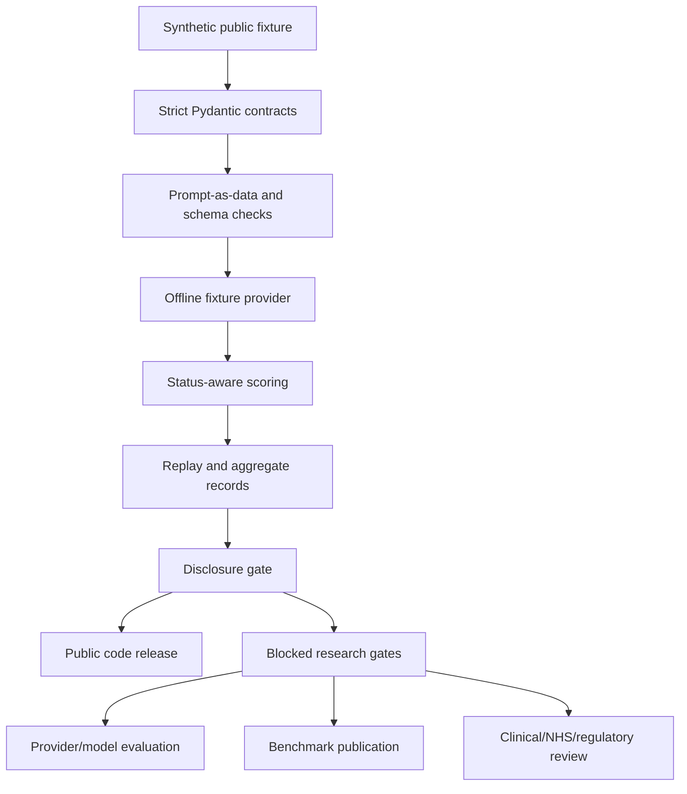

# NHSCopilot-Eval

<div align="center">


</div>

A safety-first, synthetic-only evaluation framework for checking how language models handle healthcare-oriented prompts — without using any real clinical or NHS data.

It is **not** an NHS service, clinical decision tool, validated benchmark, deployment artifact, or provider leaderboard, and it does not establish clinical safety, regulatory compliance, NHS/NICE/MHRA/WHO endorsement, real-provider performance, or deployment readiness.

## Status And Verification Boundary

Project 09 is **complete with limitations** for the public synthetic-contract scope. Research execution is **not released**, and overall research readiness is **64% (editorial)**.

| Scope | Status | Evidence |
| --- | --- | --- |
| Public synthetic-contract scope | 100% complete | This 39-file public package passed local export tests and private Kaggle CPU validation |
| Local public-export suite | Passed | `python -m pytest -q` on this export: **33 passed**, exit 0, Python 3.11.9, pytest 9.0.3 |
| Private Kaggle CPU suite | Passed | Kaggle CPU version 3: **33 passed in 1.92s**, compile exit 0, offline fixture exit 0, Python 3.12.13 |
| Private full source-suite | Passed (private boundary only) | `python -m pytest -q`: **97 passed in 2.43s**, run from the private source tree, not from this public export |
| Provider/model evaluation | Not run | No provider calls, model execution, model training, downloads, or GPU work were performed |
| Benchmark release | Not released | Replacement rows, independent review, frozen manifests, and publication review remain open |

The private Kaggle evidence path is recorded internally at `docs/evidence/kaggle-public-head-internet-on-2026-09-14.md`. This public repository includes only public-safe source, tests, synthetic fixtures, configuration, license, notices, and reproducibility instructions — no private authoring files, sealed labels, or provider output.

## Navigation

- [Status And Verification Boundary](#status-and-verification-boundary)
- [Problem](#problem)
- [What The Project Evaluates](#what-the-project-evaluates)
- [Architecture](#architecture)
- [Safety Contracts](#safety-contracts)
- [Quick Start](#quick-start)
- [Synthetic-Only Example](#synthetic-only-example)
- [Testing](#testing)
- [Reproducibility](#reproducibility)
- [Privacy And Security](#privacy-and-security)
- [Limitations](#limitations)
- [Roadmap](#roadmap)
- [Citation And License](#citation-and-license)

## Problem

Healthcare-oriented LLM evaluation work is easy to overstate. Benchmark claims often blur synthetic fixtures with real clinical validation, and safety-relevant outcomes — refusal, abstention, timeout, provider error — get silently collapsed into a single pass/fail score. NHSCopilot-Eval is a small, auditable contract layer that keeps those states distinct and keeps the synthetic, non-clinical scope of the work explicit, so any evaluation claim can be checked against evidence rather than taken on trust.

## What The Project Evaluates

- Strict contracts for requests, responses, rows, source manifests, and public bundles.
- Synthetic fixture tests, including malformed-response rejection and prompt-injection-as-data boundaries.
- Offline fixture provider behavior with no live provider call.
- Redaction helpers, deterministic hashes, replay records, split checks, scoring, reporting, and disclosure checks.
- Public-safe configuration and a target-runtime runbook.

The deterministic row generator and private/sealed toy labels are intentionally excluded from this export. Earlier public history exposed those toy labels, so they must never be treated as held-out benchmark data.

## Architecture



*Diagram description for screen readers: a synthetic public fixture flows through strict contract checks, an offline fixture provider, and status-aware scoring into replay and aggregate records, which pass a disclosure gate. That gate splits into the public code release (this repository) and a set of blocked research gates — provider/model evaluation, benchmark publication, and clinical/NHS/regulatory review — that remain closed until separately authorized.*

## Safety Contracts

- Every response resolves to exactly one of `complete`, `refusal`, `abstention`, `malformed`, `timeout`, `provider_error`, or `not_run` — these states are never merged or silently converted into a score.
- `not_run` is a first-class state for unavailable or retired models; it is never substituted with a guess.
- Benchmark prompts are treated as data. Prompt-injection fixtures are tested separately from the prompts they probe.
- A redaction helper strips common secret and PHI-shaped patterns from any text before it can reach an output artifact; it is a bounded software check, not a general-purpose PHI detector.
- The public app (where present) reads frozen aggregate data only and performs no live clinical inference.

## Quick Start

Target environment: Python 3.12.

```powershell
python -m pip install -e ".[verification]"
python -m compileall -q src scripts tests examples
python -m pytest -q
python examples/offline_fixture.py
```

No dependency installation was performed during this packaging pass — use an isolated environment (venv/conda) before installing extras.

## Synthetic-Only Example

`examples/offline_fixture.py` builds a synthetic request, calls the local fixture provider, and prints only hashes and status metadata. It writes no private output and makes no network call.

```powershell
python examples/offline_fixture.py
```

Expected mode: `synthetic_offline_fixture`.

## Testing

From the root of this export, with no installation required:

```powershell
$env:PYTHONPATH = (Resolve-Path -LiteralPath 'src').Path
python -m pytest -q
```

This export's public test suite passed **33/33** locally (Python 3.11.9, pytest 9.0.3) and **33/33** on private Kaggle CPU (Python 3.12.13). These two runs check the same 39-file public package from different environments; they are not two different test suites.

The private full source suite (97 tests) covers the private authoring tree, including split, provenance, and adjudication logic not shipped in this public export, and was run separately from the private source boundary — it is not evidence about this public package by itself.

## Reproducibility

- Declared runtime dependencies are pinned in `pyproject.toml` (Pydantic 2.11.7, PyYAML 6.0.2 for the core install; pytest 8.3.5 and Ruff 0.11.8 for `[verification]`).
- `python -m compileall -q src scripts tests examples` must pass before any test run.
- The Kaggle CPU contract runner restores this exact public package, verifies embedded file hashes, compiles it, runs the public tests, and completes the offline fixture — with providers, model execution, downloads, and GPU disabled throughout.
- Exact pinned-dependency behavior for the full 97-test private source suite in a fresh target environment remains an open, separately gated verification (see [Roadmap](#roadmap)).

## Privacy And Security

Do not place patient identifiers, clinical records, raw medical text, restricted guideline passages, credentials, provider outputs, hidden labels, or private manifests in this repository. The redaction helper covers common fixture patterns; it is not a general-purpose PHI detector.

The SDK-neutral provider adapter is guarded for future controlled work only. Current configuration disables all providers. Any future remote call requires a separate synthetic-input declaration, policy budget, session permission, and fresh approval before it can run.

## Limitations

- Fixture scorers are bounded software checks, not medical correctness measures.
- This package does not prove clinical safety, regulatory compliance, NHS endorsement, model quality, or deployment readiness.
- Exact pinned-dependency behavior for the full private source suite in a fresh target environment remains unverified.
- Replacement synthetic rows need independent review and adjudication before any benchmark claim can be made.
- No human evaluation, provider/model evaluation, clinical-data evaluation, or benchmark publication exists yet.

## Roadmap

Gated until separately approved and evidenced:

- Full 97-test private source-suite target-environment evidence.
- Pinned-dependency lock and target-runtime verification.
- Replacement-row review and adjudication.
- Frozen public/private/sealed manifests.
- Provider/model evaluation with budget and availability metadata.
- Benchmark publication review.
- Deployment review.
- Clinical/NHS/regulatory review.

## Citation And License

Use [CITATION.cff](CITATION.cff) to cite this software. The code is licensed under [MIT](LICENSE). [THIRD_PARTY_NOTICES.md](THIRD_PARTY_NOTICES.md) lists dependency notices. The MIT license covers Project 09 code only — it does not authorize use or redistribution of external clinical content.

<div align="center">


</div>
