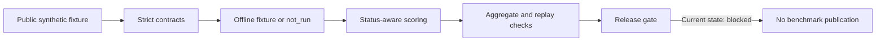

# NHSCopilot-Eval

Synthetic-only evaluation contracts and offline fixtures for inspecting language-model response handling, replay, scoring, and disclosure boundaries.

This research harness is intended for evaluation engineers and reviewers. It is **not** an NHS service, clinical decision tool, patient-facing application, or validated medical benchmark. Its fixtures do not establish clinical safety, regulatory compliance, provider quality, or deployment readiness. No institutional endorsement is claimed.

## What this public repository contains

This repository contains strict Pydantic request, response, source, row, and public-bundle contracts; response-state handling; redaction helpers; deterministic hashing and replay records; split checks; bounded fixture scoring; numeric aggregation; and a frozen aggregate catalogue. It includes an offline fixture provider and contract tests. The synthetic row generator is excluded because its source code reconstructs the toy answer keys for private and sealed splits. Earlier public repository history included that generator, so those deterministic toy labels are exposed and cannot serve as held-out benchmark data. No generated dataset, private/sealed labels, provider responses, model files, or benchmark results are included in this export.



The diagram shows the offline evaluation flow. `not_run` records are distinct from completed, refused, abstained, malformed, timed-out, and provider-error responses. The release gate rejects `available` aggregate results until an evidence-backed release path is implemented and reviewed.

## Install and verify

Use Python 3.12 for the declared target environment. From this directory:

```powershell
python -m pip install -e ".[verification]"
python -m compileall -q src scripts tests examples
python -m pytest -q
python examples/offline_fixture.py
```

Use an isolated Python environment for installation. The verification extra pins pytest; the local results below used already-installed, different versions. The optional catalogue UI requires `python -m pip install -e ".[ui]"`. The example does not launch a UI server.

## Synthetic-only example

`examples/offline_fixture.py` constructs a synthetic request, uses `LocalFixtureProvider`, and prints a redacted status/hash summary. It performs no network or model call and writes no private output. Run it with `python examples/offline_fixture.py` after installation. For the uninstalled local export, use `$env:PYTHONPATH = (Resolve-Path -LiteralPath 'src').Path; python examples/offline_fixture.py` from PowerShell. The source suite's 200-row generator is intentionally absent from this public copy; the example demonstrates contracts and local fixture behavior, not a benchmark result.

## Verified local status on 2026-09-13

| Lane | State | Evidence |
| --- | --- | --- |
| Public core implementation | Implemented, synthetic-only | Curated source and example in this directory |
| Latest original Project 09 suite | Locally tested after the row-contract and candidate-structure fixes | `python -m pytest -q`: **97 passed in 5.47s**, exit 0; source compile: exit 0 |
| Current public code export | Locally tested after the stricter row-contract update | `python -m pytest -q`: **33 passed in 0.73s**, exit 0; compile and offline example: exit 0 |
| Private Kaggle public-core snapshot | Historically tested on Python 3.12.13, non-pinned packages | Earlier 39-file upload passed **30 tests in 1.78s**, exit 0; later code edits are not covered by that run |
| Earlier 2026-09-13 source snapshot | Historical local verification | Source: **77 passed in 4.60s**, exit 0; public export: **29 passed in 1.31s**, exit 0; commit `4bdfab9` |
| Historical local test record | Historical only | 2026-08-19: 37 passed under non-target versions; superseded for local diagnostics by the 2026-09-12 result |
| Offline example | Verified with this export | Example with `PYTHONPATH=src`: exit 0, status `complete` |
| Exact pinned dependencies and complete source suite on Python 3.12 | Not verified | Local diagnostics used Python 3.11.9; the separate Kaggle public-core run used Python 3.12.13 with non-pinned packages |
| Provider and model performance | `not_run` | No provider call, model download, inference, or GPU execution |
| Clinical-data evaluation | Blocked | No patient, NHS, restricted guideline, or clinical dataset was used |
| Public benchmark release | Blocked | MIT code license is selected; rights/review/evidence gates remain open |

The numbers above count software tests, not clinical cases, model outcomes, or benchmark quality.
The Git release tree includes only the 39 curated files. Local test runs may create ignored Python and pytest caches; these are not part of the repository.

## Privacy, security, and limits

Inputs must be independently authored synthetic text. Do not place patient identifiers, clinical records, restricted guideline passages, credentials, or provider output in this project. The redaction helper covers common fixture patterns; it is not a general-purpose PHI detector. The public bundle contract rejects available metrics without a verified release-evidence path, and score/output CLI paths are confined to `data/private/`. The source contains an SDK-neutral remote adapter for future controlled work; current configuration disables providers. The adapter now checks session permission, a numeric policy budget, and a request's synthetic-input declaration before transport. That declaration is not independent proof of provenance. Timeout cancellation and actual cost enforcement remain unresolved before any remote execution.

Fixture scorers use bounded lexical rules. They do not measure medical correctness, clinical safety, source validity, or real provider performance. Private/sealed toy labels in the original development tree have not been independently reviewed or frozen. No result from this public copy should be interpreted as a clinical claim.

## Reproducibility and future runtime

Run the commands above from the export root and record Python/package versions, exact command, exit code, test count, and date. Hashes and row identities use canonical JSON; replay records retain hashes rather than raw payloads. The public package carries no private or sealed dataset, so it cannot reproduce a hidden-split evaluation.

A further Kaggle or Colab run is **gated**. The private Kaggle public-core snapshot above verified only its uploaded bytes; another run would require a separate, reviewed synthetic-only upload manifest and explicit authorization. Provider calls, model downloads, rights-sensitive source access, clinical data, benchmark publication, and deployment remain outside this source-only release. This repository publishes code and synthetic fixtures, not benchmark results.

## Citation, attribution, and roadmap

Use [CITATION.cff](CITATION.cff) to cite this software. The code is licensed under [MIT](LICENSE). [THIRD_PARTY_NOTICES.md](THIRD_PARTY_NOTICES.md) lists runtime dependencies, which retain their own licenses; no third-party source or medical source text is vendored. [DATASET_CARD.md](docs/DATASET_CARD.md) explains the synthetic fixture boundary. The MIT license does not authorize use or redistribution of external clinical content.

Next: validate the public package under target pins; replace and independently review the exposed toy evaluation rows; design evidence-bound aggregate release; harden remote transport cancellation and actual cost enforcement; then seek separate approvals for any target notebook or provider work. Until those gates close, this is research code, not a released benchmark.
