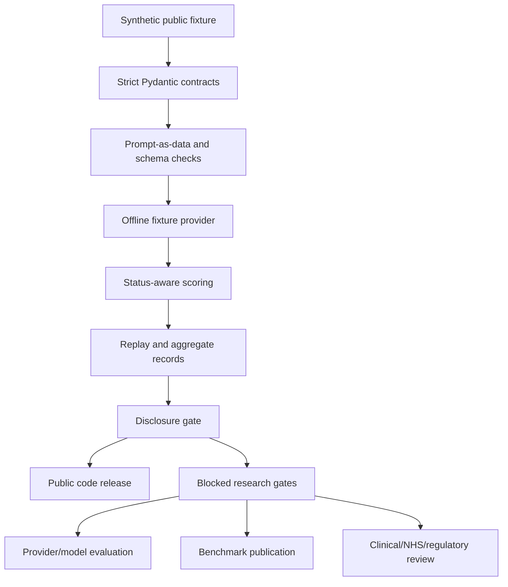

# NHSCopilot-Eval

Synthetic-only evaluation contracts and offline fixtures for checking language-model response handling, replay, scoring, and release boundaries in a healthcare-oriented research setting.

This repository is **not** an NHS service, clinical decision tool, validated benchmark, deployment artifact, or provider leaderboard. It does not establish clinical safety, regulatory compliance, NHS/NICE/MHRA/WHO endorsement, real-provider performance, or deployment readiness.

## Verified Status

Project 09 is **COMPLETE WITH LIMITATIONS** for the public synthetic-contract scope. Research execution is **NOT RELEASED**.

| Scope | Status | Evidence |
| --- | --- | --- |
| Synthetic public-contract scope | 100% complete | Current 39-file public package passed local public tests and private Kaggle CPU validation |
| Overall research readiness | 64% editorial | Remaining research gates are listed below |
| Local source suite | Passed | `python -m pytest -q`: **97 passed in 2.43s**, exit 0, run from the private source boundary on 2026-09-14 |
| Current public package on Kaggle | Passed | Private Kaggle CPU version 3: **33 passed in 1.92s**, compile exit 0, offline fixture exit 0, Python 3.12.13 |
| Provider/model evaluation | Not run | Providers, model execution, model training, downloads, and GPU work stayed disabled |
| Benchmark release | Not released | Replacement rows, independent review, frozen manifests, and publication review remain open |

The Kaggle evidence path in the private project records is `docs/evidence/kaggle-public-head-internet-on-2026-09-14.md`. The public repository includes only public-safe source, tests, synthetic fixtures, configuration, license, notices, and reproducibility instructions.

## Architecture



The public flow keeps `complete`, `refusal`, `abstention`, `malformed`, `timeout`, `provider_error`, and `not_run` states distinct. `not_run` is a first-class state and is not silently converted into a score.

## What Is Included

- Strict contracts for requests, responses, rows, source manifests, and public bundles.
- Synthetic fixture tests, including malformed-response rejection and prompt-injection-as-data boundaries.
- Offline fixture provider behavior with no live provider call.
- Redaction helpers, deterministic hashes, replay records, split checks, scoring, reporting, and disclosure checks.
- Public-safe configuration and a target-runtime runbook.
- MIT license, citation metadata, and third-party notices.

The deterministic row generator and private/sealed toy labels are intentionally excluded. Earlier public history exposed those toy labels, so they must not be treated as held-out benchmark data.

## Installation

Use Python 3.12 for the declared target environment.

```powershell
python -m pip install -e ".[verification]"
```

No dependency installation was performed during this packaging pass. Use an isolated environment before installing optional extras.

## Local Verification

From the public export root:

```powershell
python -m compileall -q src scripts tests examples
python -m pytest -q
python examples/offline_fixture.py
```

For an uninstalled checkout, run:

```powershell
$env:PYTHONPATH = (Resolve-Path -LiteralPath 'src').Path
python examples/offline_fixture.py
```

The current source-boundary local suite passed **97 tests** on 2026-09-14. The public Kaggle contract runner restored the public package, verified 39 embedded file hashes, compiled the package, ran the public tests, and completed the offline fixture.

## Synthetic-Only Example

`examples/offline_fixture.py` creates a synthetic request, calls the local fixture provider, and prints only hashes and status metadata. It writes no private output and performs no network call.

```powershell
python examples/offline_fixture.py
```

Expected mode: `synthetic_offline_fixture`.

## Privacy And Security Boundaries

Do not place patient identifiers, clinical records, raw medical text, restricted guideline passages, credentials, provider outputs, hidden labels, or private manifests in this repository. The redaction helper covers common fixture patterns; it is not a general-purpose PHI detector.

The SDK-neutral provider adapter remains guarded for future controlled work. Current configuration disables providers. Any future remote call requires a separate synthetic-input declaration, policy budget, session permission, and fresh approval.

## Limitations

- Fixture scorers are bounded software checks, not medical correctness measures.
- The package does not prove clinical safety, regulatory compliance, NHS endorsement, model quality, or deployment readiness.
- Exact pinned dependency behavior for the full private source suite remains unverified.
- Replacement synthetic rows need independent review and adjudication before any benchmark claim.
- No human evaluation, provider/model evaluation, clinical-data evaluation, or benchmark publication exists.

## Gated Future Work

Future work remains blocked until separately approved and evidenced:

- full 97-test source-suite target-environment evidence;
- pinned dependency lock and target-runtime verification;
- replacement-row review and adjudication;
- frozen public/private/sealed manifests;
- provider/model evaluation with budget and availability metadata;
- benchmark publication review;
- deployment review;
- clinical/NHS/regulatory review.

## Citation And License

Use [CITATION.cff](CITATION.cff) to cite this software. The code is licensed under [MIT](LICENSE). [THIRD_PARTY_NOTICES.md](THIRD_PARTY_NOTICES.md) lists dependency notices. The MIT license covers Project 09 code only; it does not authorize use or redistribution of external clinical content.
